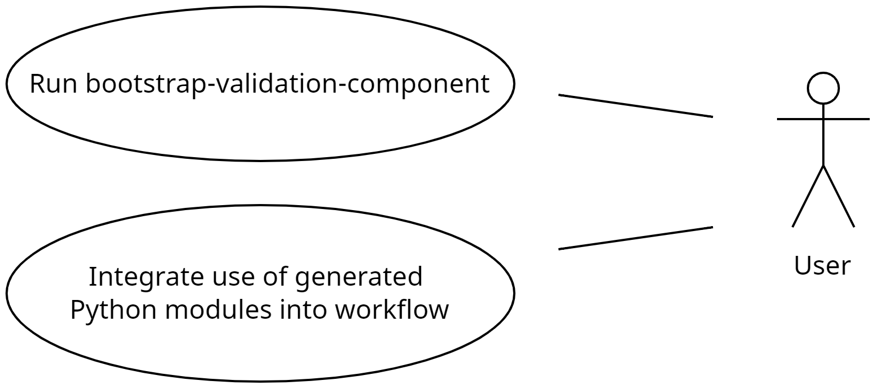
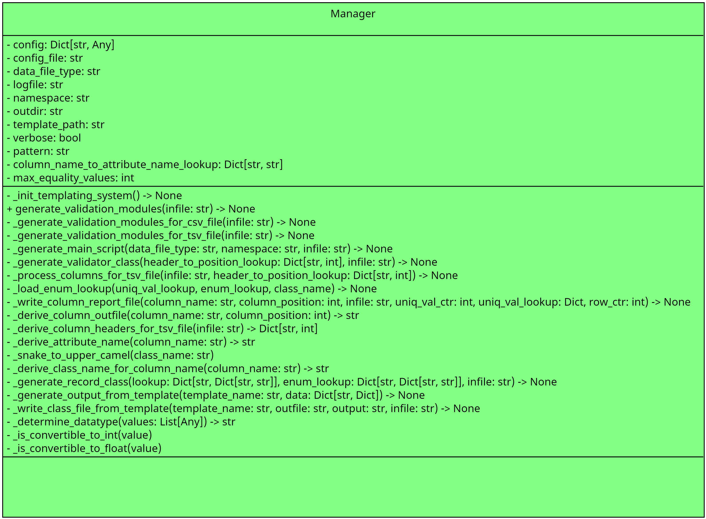

# validation-component-bootstrap-utils
Collection of scripts and utilities for bootstrapping validation components.

- [validation-component-bootstrap-utils](#validation-component-bootstrap-utils)
  - [Motivation](#motivation)
  - [Improvements](#improvements)
  - [Use Cases](#use-cases)
  - [Installation](#installation)
  - [Class Diagrams](#class-diagrams)
  - [Installation](#installation-1)
  - [Generate shell wrapper scripts](#generate-shell-wrapper-scripts)
  - [Exported scripts](#exported-scripts)
  - [Contributing](#contributing)
  - [To-Do/Coming Next](#to-docoming-next)
  - [CHANGELOG](#changelog)
  - [License](#license)


## Motivation

This will help to auto-generate some amount of boilerplate code including the following:
- record.py which contains a Pydantic Record class
- validator.py which contains a non-Pydantic Validation class
- validate_files.py which will be the primary driver of the generated validation software component

## Improvements

Please see the [TODO](docs/TODO.md) for a list of upcoming improvements.


## Use Cases




## Installation

See this [documentation](docs/INSTALL.md) for instructions.

## Class Diagrams

Here is the class diagram:



## Installation

Please see the [INSTALL](docs/INSTALL.md) guide for instructions.

## Generate shell wrapper scripts

After executing `pip install validation-component-bootstrap-utils`, execute this exported script: `make_executables_and_aliases.py`.<br>
This will create the wrapper shell scripts and a file containing aliases named `validation-component-bootstrap-utils-aliases.txt` in the current directory.<br><br>
You can then add this line to your .bashrc or .zshrc:<br>
`source dir/validation-component-bootstrap-utils-aliases.txt`<br>
where dir is the directory that contains the aliases file.


## Exported scripts

To use the exported script `bootstrap-validation-component`.

For example:

```bash
bootstrap-validation-component  --infile examples/sample.tsv --data_file_type VCF --namespace su.vcf --verbose                           
--config_file was not specified and therefore was set to 
'/home/sundaram/projects/validation-component-bootstrap-utils/venv/lib/python3.10/site-packages/validation_component_bootstrap_utils/conf/conf
ig.yaml'
--outdir was not specified and therefore was set to '/tmp/generate_validation_module/2023-12-19-123510'
Created output directory '/tmp/generate_validation_module/2023-12-19-123510'
--template_path was not specified and therefore was set to 
'/home/sundaram/projects/validation-component-bootstrap-utils/venv/lib/python3.10/site-packages/validation_component_bootstrap_utils/templates
/validation'
--logfile was not specified and therefore was set to '/tmp/generate_validation_module/2023-12-19-123510/generate_validation_module.log'
Wrote validator.py file '/tmp/generate_validation_module/2023-12-19-123510/su/vcf/validator.py'
Wrote validate_file.py file '/tmp/generate_validation_module/2023-12-19-123510/validate_file.py'
Wrote column report file '/tmp/generate_validation_module/2023-12-19-123510/0_#CHROM.tsv'
Wrote column report file '/tmp/generate_validation_module/2023-12-19-123510/1_POS.tsv'
Wrote column report file '/tmp/generate_validation_module/2023-12-19-123510/2_ID.tsv'
Wrote column report file '/tmp/generate_validation_module/2023-12-19-123510/3_REF.tsv'
Wrote column report file '/tmp/generate_validation_module/2023-12-19-123510/4_ALT.tsv'
Wrote column report file '/tmp/generate_validation_module/2023-12-19-123510/5_QUAL.tsv'
Wrote column report file '/tmp/generate_validation_module/2023-12-19-123510/6_FILTER.tsv'
Wrote column report file '/tmp/generate_validation_module/2023-12-19-123510/7_INFO.tsv'
Wrote record.py file '/tmp/generate_validation_module/2023-12-19-123510/su/vcf/record.py'
The log file is '/tmp/generate_validation_module/2023-12-19-123510/generate_validation_module.log'
Execution of 
'/home/sundaram/projects/validation-component-bootstrap-utils/venv/lib/python3.10/site-packages/validation_component_bootstrap_utils/generate_
validation_module.py' completed
```

## Contributing

Pull requests are welcome. For major changes, please open an issue first
to discuss what you would like to change.

## To-Do/Coming Next

Please view the listing of planned improvements [here](docs/TODO.md).

## CHANGELOG

Please view the CHANGELOG [here](docs/CHANGELOG.md).

## License

[GNU AFFERO GENERAL PUBLIC LICENSE](docs/LICENSE)
